# 2025-OOPL Proposal Lab

## OOPL Lab 01 - 提交 Proposal

⚠️ Due Date: 2025/02/28 ⚠️

在這個 Lab 中，你將：

- 撰寫 Proposal
- 複習 Git 相關操作
- 學會如何操作 GitHub

請先建立一個 GitHub 帳號，接著就可以開始進行這一個 Lab。

## 實驗目標

在這個 Lab 中，你需要將 Proposal 透過 PR（Pull Request）發送到我們的[課程專案](https://github.com/Okapi-Oriented-Programming/2025-OOPL)，它將長得像這樣。

透過 PR，我們可以針對於你的 Proposal 進行留言與審核，以及所有人都可以看到其他人的提案。

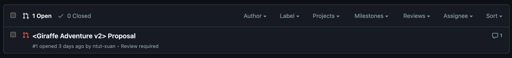

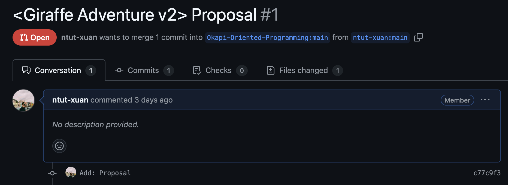

對於更多的資訊，請參考[課程專案的 PR 頁面](https://github.com/Okapi-Oriented-Programming/2025-OOPL/pulls)。

對於 Proposal 規定的格式，請參考章節「Proposal 格式」。

## 手把手教你完成 Lab

在這一個章節中，我將解釋需要這樣做的動機與原理。

### 什麼是 Pull Request？

在這一學期中，我們為你們準備了一個課程的專案，每個人都可以在上面修改東西（我們稱之為貢獻），無論是提交課程 Proposal，又或是更新自己的小組資訊。當然，如果每個人都可以在上面無條件的修改東西，那就會導致世界大亂，例如組別 A 改掉了組別 B 的 Proposal，甚至是某個人把所有人的 Proposal 刪除，因此，所有的變更均需要透過管理者的同意。

Pull Request 就像是發送變更的申請，你可以隨時發送 Pull Request，並且我們可以針對你的 Pull Request 進行審核。

### 那麼，我要怎麼變更？

由於你不能直接修改課程的專案，所以，你需要複製一份課程的專案下來，我們稱之為 [Fork](https://docs.github.com/en/pull-requests/collaborating-with-pull-requests/working-with-forks/fork-a-repo)。

當你看到一個專案時，你可以進行 Fork，將這個專案複製一份到自己的專案庫。

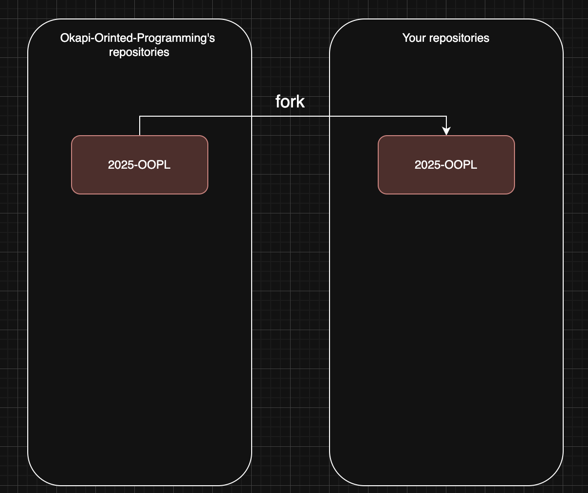

就像上圖這樣，Okapi-Oriented-Programming 這個組織有一個 2025-OOPL 的專案，你可以透過 fork 將這個專案複製一份到自己的專案庫中。

### 那麼，我要怎麼 Fork？

在專案的頁面上左上角，你可以找到 Fork 的按鈕，按下去後即可進行 Fork。

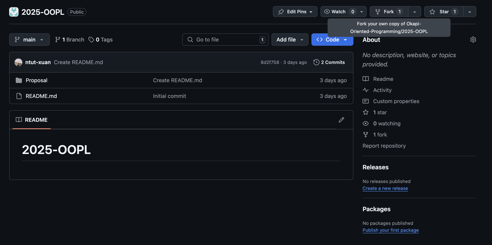

接著，按下 Create Fork。

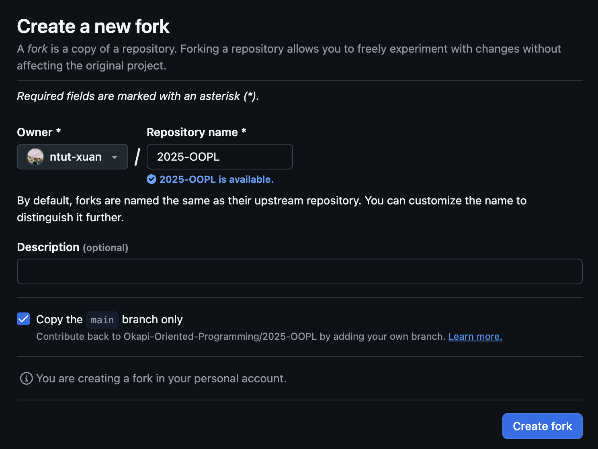

等待片刻後，你就有了複製的 2025-OOPL 專案在自己的專案庫中。

可以看到，左上角的專案庫名字是自己的，並且有 `forked from Okapi-Oriented-Programming/2025-OOPL`，點擊後可以回到你 Fork 的專案的上游。

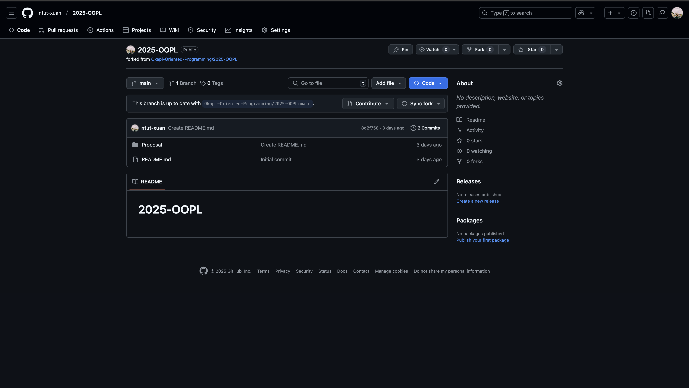

由於是複製，在這邊做的任何修改都不會影響到課程專案，所以你可以在這邊建立自己的 Proposal。

接下來，你可以開始建立自己的 Proposal，在這之前，請先將你的專案從 GitHub Clone 至自己的電腦。

### Clone 專案至自己的電腦

看到專案頁面右上角有個 `Code` 的按鈕，點擊一下，可以看到兩種不同的連結，分別是 HTTPS 與 SSH。

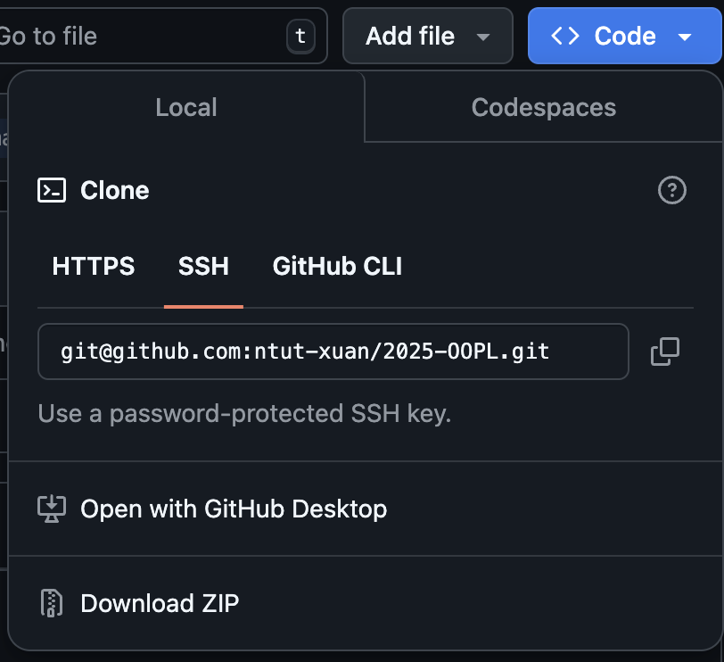

你需要使用 SSH Clone，理由的部分請見補充內容。

將這個連結複製下來，在電腦中開啟一個 Terminal（Windows 的話是 Powershell、MacOS 是 item 或者 terminal）。

輸入 `git clone` 並貼上複製的連結，按下 Enter。

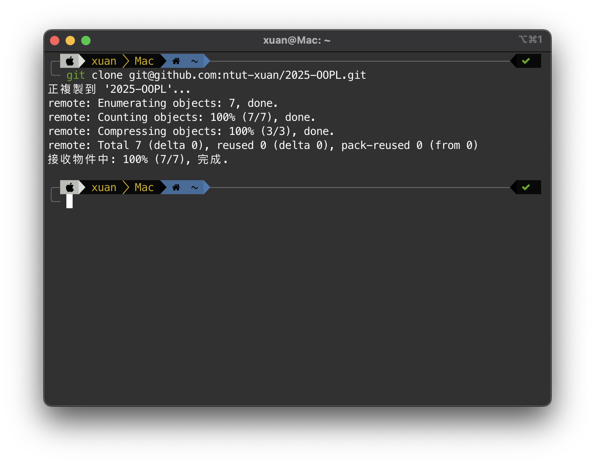

這個步驟即會將專案複製到當前 Terminal 所在的目錄，你就可以開始修改了。

### 建立自己的 Proposal

進到 `2025-OOPL/` 的資料夾中，你會發現這樣的檔案結構。

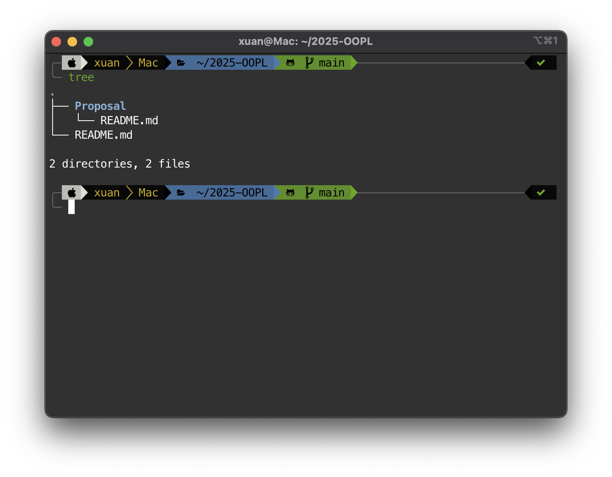

你需要在 Proposal 資料夾中，建立一個以組員學號為名字的資料夾（舉例：`109590031` 或者 `109590031-109590032`），並且在資料夾內放入 `Proposal.md`。

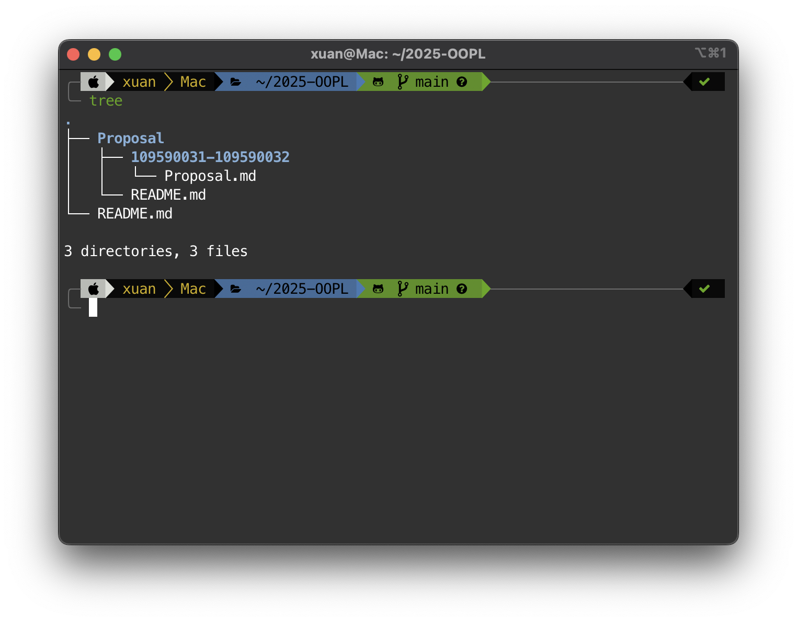

接著，你就可以開始編輯 `Proposal.md` 的內容，在裡面撰寫自己的 `Proposal` 內容。

### 將 Proposal 推到自己的 GitHub 專案庫

當你完成了 Proposal 的撰寫後，你可以將你的 Proposal 推到自己的 GitHub 專案庫。

以下的指令應該要在具有 `.git` 的資料夾執行。

```sh
git add .
git commit -m "Add: Proposal"
git push origin main
```

回到專案的頁面上，你可以發現你的 commit 出現了。

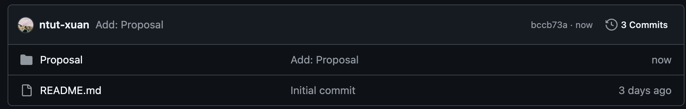

接下來，你就可以開始發起 Pull Request 了。

### 發起 Pull Request

點擊 Contribute，並且點擊 Open Pull Request。

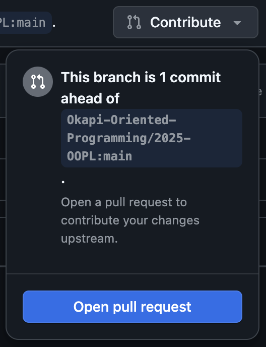

接下來，你可以開始撰寫標題與內文，標題請使用格式「<遊戲名稱> Proposal」，並且描述你的內文。

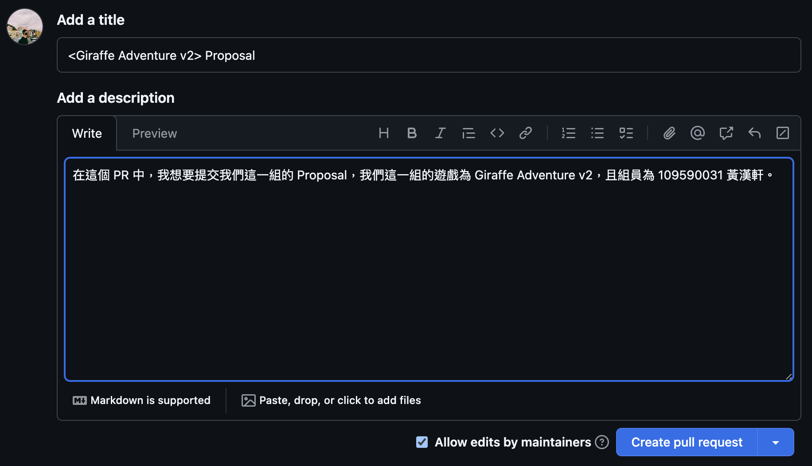

按下 Create pull request，一切完成。

以上，這樣你就瞭解如何將 Proposal 發至我們的課程專案。

### 它什麼時候會被 Merge 並且對課程專案造成變更？

當我們收到 Pull Request 時，我們會對 PR 進行審核，並且決定是否要 Approved。

當你收到了回饋時，請進行修正，而當你收到 Approved 時，我們就會將 PR 併入課程專案。

## Proposal 格式

```
# Abstract

遊戲名稱：Giraffe Adventure v2

組員：

- 109590031 黃漢軒

# Game Introduction

描述你的遊戲內容與簡介，並且描述期望完成的內容。請額外確認你的遊戲至少要包含「會死掉」、「會獲勝」與「有關卡」三種屬性。
並且，如果有遊戲影片，附上你的遊戲影片以利於讓我們瞭解你的遊戲內容。

# Development timeline

- Week 1：準備素材
  - [ ] 蒐集遊戲的素材
- Week 2：處理遊戲的封面
  - [ ] 處理遊戲封面的素材
  - [ ] 進行遊戲封面的設計
- Week 3：（某個主題）
- Week 4：（某個主題）
...
```

## 補充內容

### Q1: 為什麼我們需要使用 SSH Clone？

SSH 基本上可以處理身份驗證的部分，目前 GitHub 不支援使用 HTTPS 進行身份驗證，因此你一定得要使用 SSH，GitHub 才會知道你的身份，並且決定你是否可以修改你的專案資料庫。

除此之外，如同課程時的訓練，你需要提供 Public Key 給 GitHub，你才可以通過 GitHub 的身份驗證，並且推送東西到你的專案庫上。

### Q2: 我要怎麼新增 Public Key 至 GitHub？

進入 [Settings/SSH and GPG keys](https://github.com/settings/keys)，按下 New SSH key，並且貼上你的 Public Key，之後點擊「Add SSH key」按鈕。
